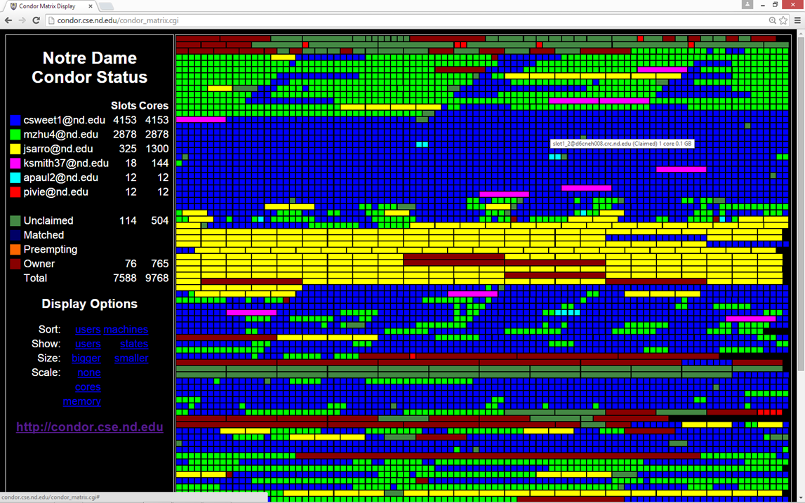
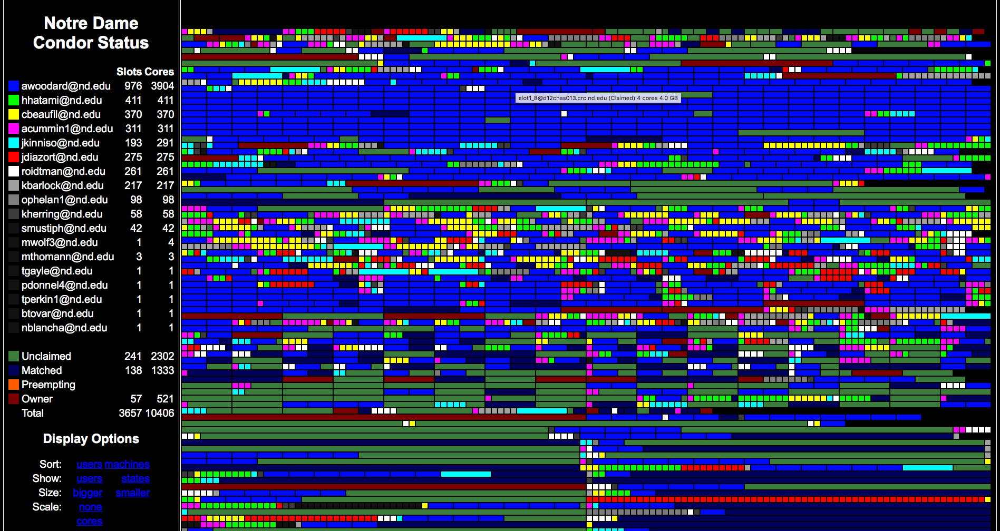

# htcondor-matrix
Displays an active HTCondor pool as a graphical matrix.

## Overview

This is a simple real-time visualization of an [HTCondor](http://research.cs.wisc.edu/htcondor) pool.
Each rectangle in the display represents a single slot in the pool,
where the color represents the user running a job on the slot,
or the machine state.  The size of the rectangle represents either
the cores or memory used by that job.

## Examples

<a href=example.png></a>
<a href=example2.png></a>

[Live Matrix Display at Notre Dame](http://condor.cse.nd.edu/condor_matrix.cgi)

## Principle of Operation

The main trick here is to avoid overloading the HTCondor central
manager with a flood of requests from active web pages.  To that
end, the code is split into two parts.  A cron job runs once a minute
to dump information about the condor pool into a temporary file.
The web page itself simply loads this file and produces the display,
in the form of floating divs that are laid out automatically by
the browser.  In this way, the display is always immediately responsive,
even if the status request should be delayed by other events
in the HTCondor pool.

## Installation

This code is currently rather 'raw' since it was only built
to run at Notre Dame.  But, it can be made to run elsewhere
with a little effort.

Do the following on your web server:

1. Modify CONDOR_PATH in `condor_matrix_cronjob.sh` to point to your HTCondor installation.  Run `./condor_matrix_cronjob.sh` directly by hand, and observe that it creates files in `/tmp/condor.data`

2. Set up a cron job to run `condor_matrix_cronjob.sh` once per minute.  You may be able to do this by running `crontab -e` and then saving the following crontab:
```
* * * * * /path/to/condor_matrix_cronjob.sh
```
Watch `/tmp/condor.data` for a minute to verify that the files are being updated.

3. Place `condor_matrix.cgi` in a suitable directory that is exported by your webserver, then access the URL directly.

## Credits:

Originally created by Nicholas Jaeger as a summer project
at the University of Notre Dame, with some small improvements
by Douglas Thain.


